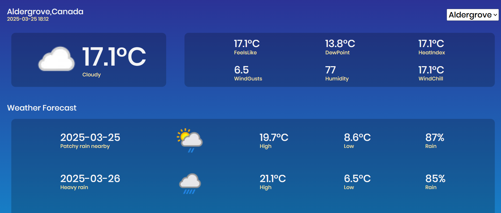
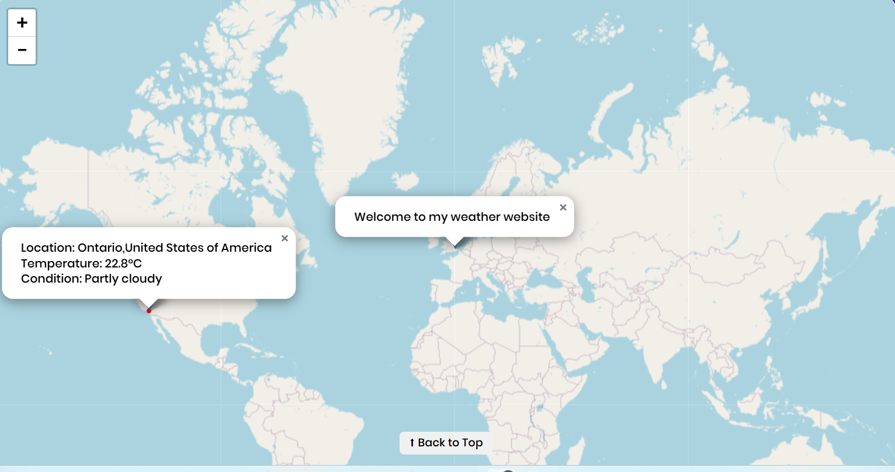

# Project Title:Interactive Weather Website

This project is weather forcasting website that allows user to view weather conditions and forecast for 3 days for 3 differnt locations.The locations are Aldergrove,Ontario and Edmonton.It pulls data from 3 different APIs and these APIs are holding static data for 3 locations only.It display weather conditions such as temprature,wind speed and humidity.

# Features:

- Dropdown:User can select a location to see weather for a particular location
- Map :It shows the current weather conditions if user clicks on the location name.
- 3-days forecast:It shows 3 days forecast with low/high tempratures,rain probability and other weather conditions.
- Responsive Design:The website is compatible with differnt screen sizes mobile,tablet and desktop.
- Weather Icons:It shows the weather condictions such as rainly,cloudy and sunny.
- The website is using html,css and javaScript.

# Screenshots

# Project Difficulities

It was challenging to decide from where to start. So, I decided to follow a mock to design the webpage. But, all the html/css has been created as per own knowledge.
- The first challenge was to fetch data from APIs. This website is using 3 APIs ,those are holding static data for 3 days only and also these are saved as gist files on GitHub account. It was little tricky to fetch data from an array of APIs.
- Second challenge was to decide when you have all the data, how to fetch location specific data from API. Because, each API is holding data for only one location.
- Third challenge was to make this website responsive as per different screen sizes.
- Fourth challenge was background and forground color contrast ratio
- Fifth challenge was when user clicks location ,the popup was being added to map.But user has to scroll down to see the popup on 2nd page of the website.

# Project Wins

- Responsiveness issue helped to understand how to use @font-face and clamp to make font responsive
- Using 3 API helped to understand how Promise.all and asyn/await are working .Promise.all helped to fetch 3 APIs in parallel order and which was faster than aync/await's sequential behviour
- The project has two JS files one for map and other for weather data.This project helped to understand various concepts such as how to create functions and where you should call those ,DOM maniputaion,events listeners,global and private variables:map.js was accessing global variables from index.js file
- Windows scroll function
- Creating classes dynamically in JavaScript
